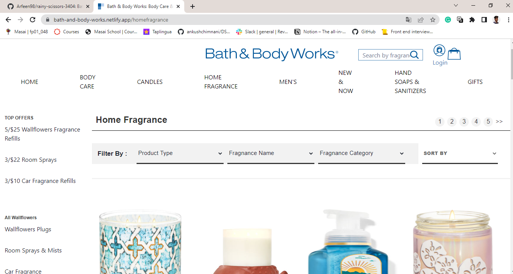

<h1 align="center">Bath & Body Works Clone</h1> 

<br />
<p align="center">
    
    
    
    
    
    
    
    
    
</p>

<h3 align="center"><a href="https://bath-and-body-works.netlify.app/"><strong>Want to see live preview »</strong></a></h3>

<p align="center"> 
    <br /> 
    <a href="https://github.com/Arfeen98/rainy-scissors-3404/issues">Report Bug</a> &#10023
    <a href="#Getting-Started">Getting Started</a> &#10023;
    <a href="#Install">Installing</a> &#10023;    
    <a href="#Contact">Author</a> &#10023;
  </p>
 Bath & Body Works, LLC. is an American web application that caters premium soaps, lotions, fragrances, and candles


  ## Screens
   - Homepage
   - Body Care
   - Candles
   - Home Fragrance
   - Hand Soaps & Sanitizers
   - Details Page
   - Cart
   - Checkout
   - Login / Signup
   
   <br />

## 🚀 Features
- Login/Signup User Account
- Sort functonality
- Dynamic homepage with product catalog
- Add to cart page
- Increase/decrease count in cart products
- Payment Page

<br />

## Glimpses of Bath & Body Works- Clone 🙈 :


<table>
  <tr>
    <td></td>
    <td></td>
  </tr>
  <tr>
    <td></td>
    <td></td>
  </tr>
  <tr>
    <td></td>
    <td></td>
  </tr>
 
</table>

<br />


## Getting Started

This project was built using React v 17.0.2, Redux v 4.1.1, Chakra UI, CSS, JavaScript, Rest API. It is a web application that caters premium bath and body products.

### Prerequisites

- NPM 

### Setup


The project repository can be found in [GitHub link](https://github.com/Arfeen98/rainy-scissors-3404) or just clone the project using this command. 


```
Using HTTPS
# git clone  https://github.com/Arfeen98/rainy-scissors-3404
```

+ Open terminal on your workspace with

```
cd /home/workspace/rainy-scissors-3404
```

## Install

Install NPM

Check that you have npm installed

To install all the dependences of the project, run the following command:

```
cd Bath_Body
npm install
```


To run the application got to the client folder and run the following command:

```
npm start
```


### Tools used on this project

- Visual Studio Code - IDE
- create-react-app - React App
- Postman - API Testing

<br/>


## Contact The Team

If you want to contact us, you can reach us through below handles.

<h3>Arfeen Mushtaque  - Team Lead</h3>

[](https://www.linkedin.com/in/arfeen-mushtaque-7a5988225/)
[](https://github.com/Arfeen98)


<h3>Soumya Moulik - Team Member</h3>

[](https://www.linkedin.com/in/soumya-moulik/)
[](https://github.com/Moulik98)


<h3>Krishan Kumar Safi - Team Member</h3>

[](https://www.linkedin.com/in/krishan-kumar-safi-024794224/)
[](https://github.com/Krishukr12)

<h3>Bharat Rozodkar - Team Member</h3>

[](https://www.linkedin.com/in/bharat-rozodkar-76a5a8236/)
[](https://github.com/rozodkarbharat)

© 2022 Team rainy-scissors-3404


## Show your support

Give a ⭐️ if you like this project!
